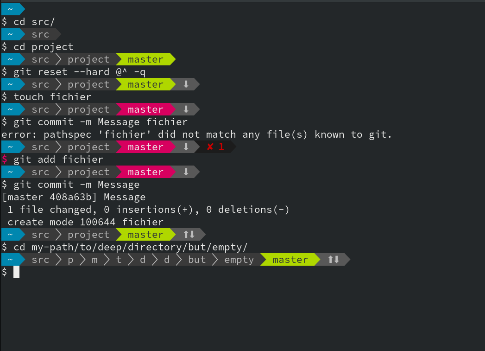
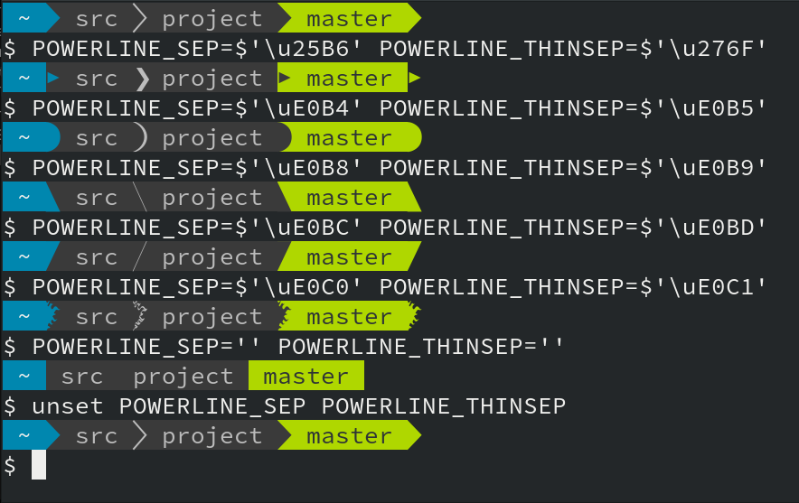

# `powerline.bash`

`powerline.bash` est une invite de commande dynamique dans le style Powerline,
pour BASH.




## Fonctionalités

- S'installe facilement. *Un seul fichier sans dépendances*.
- *Très rapide*. Environ 30ms pour générer l'invite. *Pas de serveur !*
- Sur deux lignes pour faciliter le *copicollage* et la garder le curseur au
  même endroit.
- `utilisateur@hôte` si dans un client SSH ou sudo, *coloré dynamiquement*.
- Dossier courant, compressé avec l'initiale si trop long.
- Nom du *virtualenv* Python.
- Infos *git* : branche courante, modifications non validées, désynchronisation
  avec la branche amont.
- En cas de commande en erreur, affichage du code de sortie et coloration du `$`.
- *Configurable* par des variables d'env. Pas de fichier.
- *Extensible*.


## Installation

``` console
$ curl -Lo ~/.config/powerline.bash https://gitlab.com/bersace/powerline-bash/raw/master/powerline.bash
$ $EDITOR ~/.bashrc
# Copier et adapter ceci dans votre .bashrc
. ${HOME}/.config/powerline.bash
PROMPT_COMMAND='__update_ps1 $?'
$ exec $SHELL
```

Les chevrons façon Powerline requièrent une police adaptée. Il y en a plein à
https://nerdfonts.com/ . J'utilise Sauce Code Pro. Sinon, voir la section dédiée
ci-dessous.


## Configuration

Les variables d'env sont prise-en-compte sans recharger le shell.

`POWERLINE_SEGMENTS` liste les infos à afficher. Par défaut `hostname pwd venv
git status`.

`POWERLINE_STYLE` le style d'affichage. Par défaut `default`.

`POWERLINE_SEP` le séparateur de segments, avec changement de couleur.

`POWERLINE_THINSEP` le séparateur de dossier, sans changement de couleur.




## Compatibilité avec les polices

Si vous utilisez une police sans les symboles Powerline, vous pouvez configurer
l'invite pour avoir un mode dégradé.

- `POWERLINE_SEP=$'\u25B6' POWERLINE_THINSEP=$'\u276F'` utilise des symboles
  universels, mais moins adaptés.
- `POWERLINE_SEP='' POWERLINE_THINSEP=''` désactive les séparateurs.

Positionner ces variables dans votre `.bashrc`, après l'import de
`powerline.bash`, sans exporter les variables.


## Références

- https://github.com/b-ryan/powerline-shell
- https://github.com/skeswa/prompt
