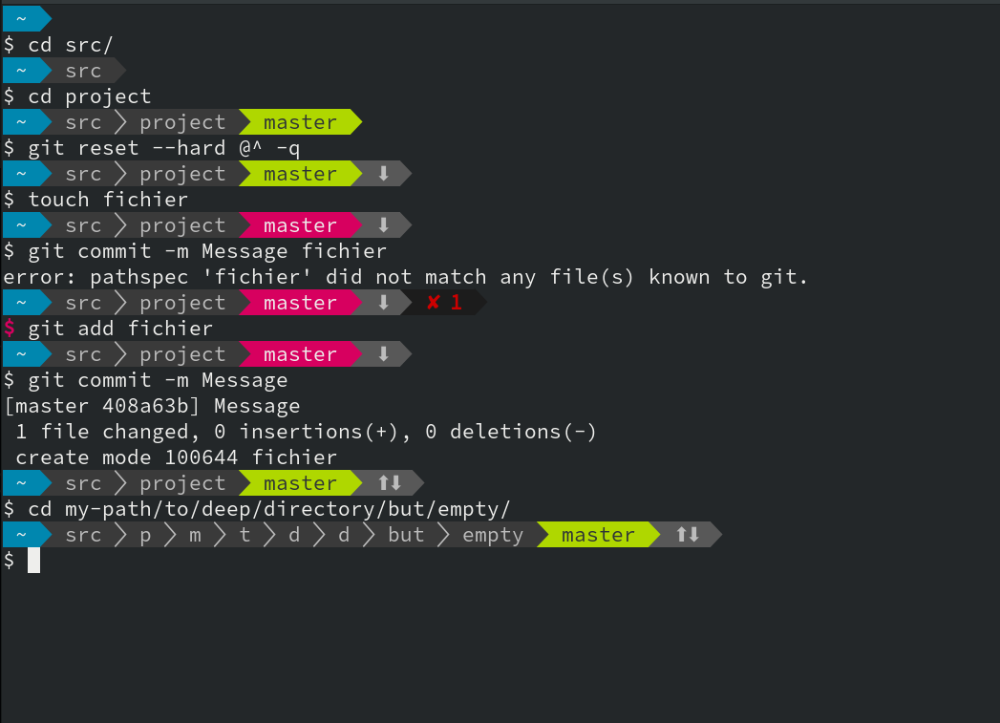
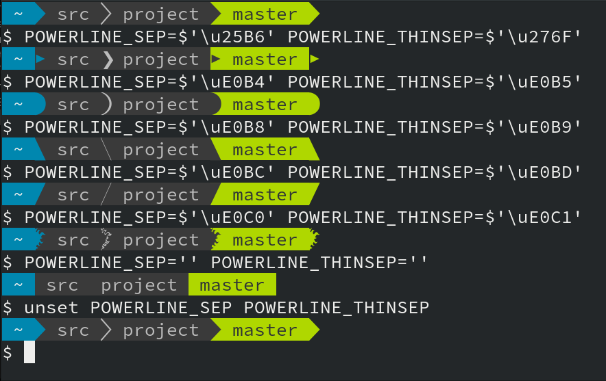
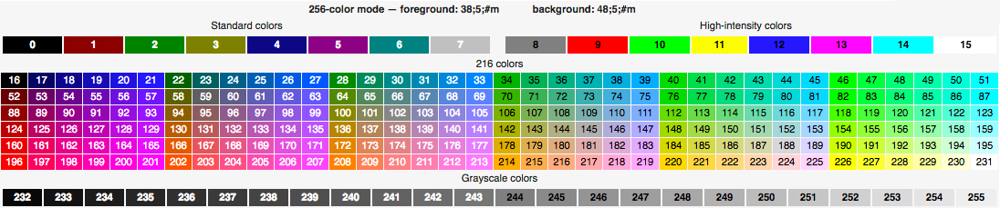

# `powerline.bash`
`powerline.bash` est une invite de commande dynamique dans le style Powerline,
pour BASH.




## Fonctionalités
- *Installation facile*. Un seul fichier sans dépendances.
- *Très rapide*. Jusqu'à seulement 10ms pour générer l'invite. *Pas de serveur !*.
- Sur deux lignes pour faciliter le *copicollage*, garder le curseur au même endroit et laisser de la place aux longues commandes.
- `utilisateur@hôte` si connecté en sudo ou SSH, *coloré dynamiquement*.
- Dossier courant avec *dossiers intermédiaires abrégés*.
- En cas de commande en erreur, affichage du code de sortie et coloration du `$`.
- *Icônes* optionnelles avec [icons-in-terminal] ou [Nerd Fonts].
- De nombreux segments disponibles : git, Python, Docker, OpenStack, Maildir, Kubernetes, etc.
- *Configurable* par des variables shell. Pas de fichier.
- *Extensible* : rédigez une fonction bash et vous avez votre segment personnel.

[icons-in-terminal]: https://github.com/sebastiencs/icons-in-terminal/
[Nerd Fonts]: https://github.com/ryanoasis/nerd-fonts/

## Installation
Installe le fichier `powerline.bash` dans le repertoire `$HOME/.config/`
puis configurer le fichier `.bashrc`
```console
$ curl -Lo ~/.config/prompt/powerline.bash https://gitlab.com/bersace/powerline-bash/raw/master/powerline.bash
$ $EDITOR ~/.bashrc
# Copier et adapter ceci dans votre .bashrc
. ${HOME}/.config/prompt/powerline.bash
PROMPT_COMMAND='__update_ps1 $?'
$ exec $SHELL
```
Verification que le fichier `powerline.bash` existe:
```bash
if [ -f ${HOME}/.config/prompt/powerline.bash ]; then
    # Copier et adapter ceci dans votre .bashrc
    . ${HOME}/.config/prompt/powerline.bash
    PROMPT_COMMAND='__update_ps1 $?'
fi
```

Les chevrons façon Powerline requièrent une police adaptée. Il y en a plein à
https://nerdfonts.com/ . J'utilise Sauce Code Pro. Sinon, voir la section dédiée
ci-dessous.


## Configuration
Les variables d'env sont prise-en-compte sans recharger le shell.

`POWERLINE_SEGMENTS` liste les infos à afficher. Par défaut `hostname pwd venv
git status jobs`.

`POWERLINE_STYLE` le style d'affichage. Par défaut `default`.

`POWERLINE_SEP` le séparateur de segments, avec changement de couleur.

`POWERLINE_THINSEP` le séparateur de dossier, sans changement de couleur.



Pour personnaliser la couleur du prompt utiliser ce tableau:



## Compatibilité avec les polices

Si vous utilisez une police sans les symboles Powerline, vous pouvez configurer
l'invite pour avoir un mode dégradé.

- `POWERLINE_SEP=$'\u25B6' POWERLINE_THINSEP=$'\u276F'` utilise des symboles
  universels, mais moins adaptés.
- `POWERLINE_SEP='' POWERLINE_THINSEP=''` désactive les séparateurs.

Positionner ces variables dans votre `.bashrc`, après l'import de
`powerline.bash`, sans exporter les variables.


## Références
- https://gitlab.com/bersace/powerline.bash
- https://github.com/b-ryan/powerline-shell
- https://github.com/skeswa/prompt

**Font:**
- https://github.com/ryanoasis/nerd-fonts
